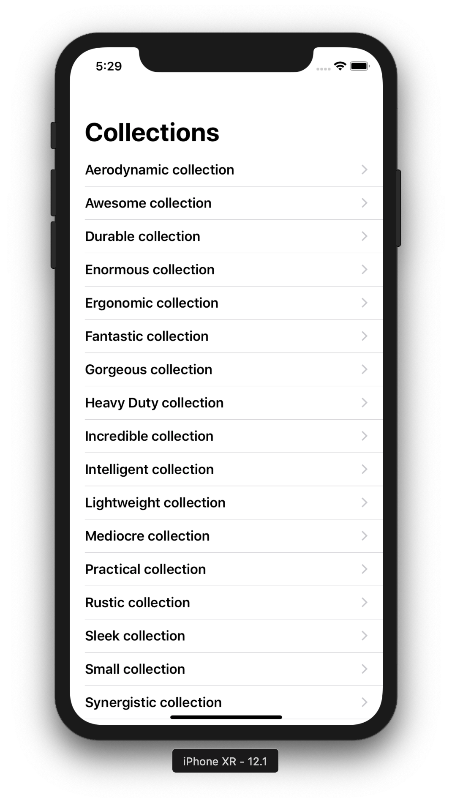
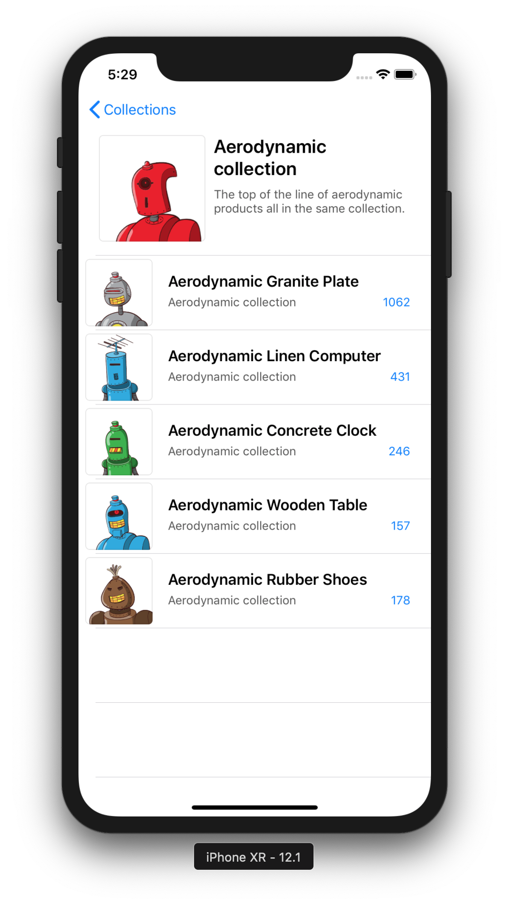

# Shopify Mobile Developer Intern Challenge S19

Doc: https://docs.google.com/document/d/1h3TFW9HhFxBVrmgd33dNrUiJx31NQFn6dpZHrbrSP-U/edit

This is my submission for Shopify's mobile developer internship challenge for the summer 2019 term.

## Deviations and Limitations from Spec
There were a few questions that I had regarding the challenge specification where I felt it was better to deviate. In a practical environment, I would address these to my product owner/manager regarding design decisions. This section explains my reasoning.

### 1. Collection Detail Rows
The challenge specification requested each row to have at minimum the collection title, image, product name, and total inventory. From a UI design perspective, I was not sure if this was the desired outcome as there were many redundancies. I instead used the product image, as it made more sense to couple the identifier.

